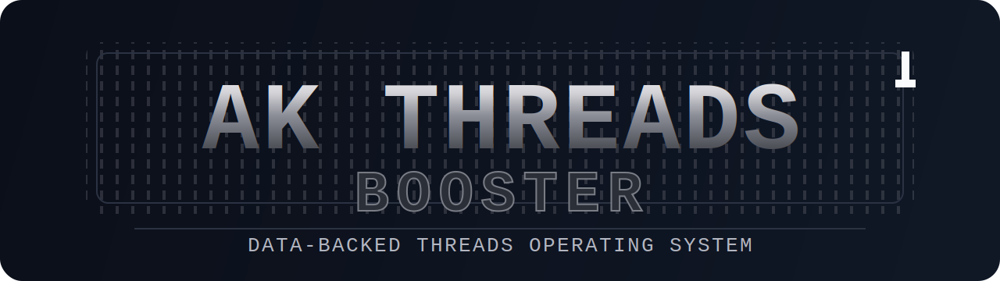

[繁體中文](README.md) | [English](README.en.md) | [日本語](README.ja.md) | [한국어](README.ko.md) | [Português](README.pt.md) | [हिन्दी](README.hi.md) | [Bahasa Indonesia](README.id.md) | [ภาษาไทย](README.th.md) | [Español](README.es.md) | [Deutsch](README.de.md) | [Français](README.fr.md) | [Tiếng Việt](README.vi.md)

<div align="center">



<p>
  <a href="./LICENSE"></a>
  
  
  
  <a href="https://www.threads.com/@darkseoking"></a>
</p>

</div>


# AK-Threads-Booster

> **Current Version**
> - decision-first `/analyze` flow
> - tracker-only fallback when full setup files are missing
> - checkpoint review for all users
> - API-backed `snapshots[]` and `performance_windows` via `scripts/update_snapshots.py`

Uma skill open-source de Claude Code e assistente de escrita com IA feita sob medida para criadores no Threads. O Threads no Brasil tem uma das comunidades mais engajadas do mundo, e esse projeto nasceu para resolver um problema real: como transformar toda essa energia de interacao em crescimento consistente de seguidores e alcance.

O AK-Threads-Booster analisa seus dados historicos de postagens, aplica pesquisas de psicologia de redes sociais e mecanismos do algoritmo do Threads para entregar analise personalizada de escrita, perfil de Brand Voice e assistencia na criacao de rascunhos. Se voce esta procurando uma ferramenta AI para redes sociais que realmente aprende com os seus proprios dados, uma estrategia de conteudo baseada em metricas reais, ou dicas de Threads que vao alem do generico, esse e o projeto.

Nao e template. Nao e lista de regras. E um consultor que te ajuda a entender o algoritmo do Threads e transformar seus dados em engajamento real no Threads. Funciona como skill / plugin para Claude Code, Cursor, Codex, Windsurf, GitHub Copilot e Google Antigravity.


## Inicio Rápido

1. Adicione o repo a sua ferramenta de IA.
2. Rode `/setup` para importar os posts historicos.
3. Depois de escrever, use `/analyze`; antes de publicar, use `/predict` se precisar.
4. Depois de publicar, use `/review` para checkpoints de 24h e 72h.
5. Se tiver um token da Threads API, rode `scripts/update_snapshots.py` para snapshots.

## Atualizacao de Dados

- **Modo checkpoint**: para todos os usuarios. `/review` coleta valores de 24h, 72h e 7d e atualiza a base de previsao.
- **Modo snapshot**: com a Threads API. `scripts/update_snapshots.py` grava `snapshots[]` e atualiza os `performance_windows` mais proximos.

---

## O Que e o AK-Threads-Booster

AK-Threads-Booster e uma skill open-source para Threads. Nao e um modelo de postagem, nao e um conjunto de regras, e nao e um gerador de conteudo que te substitui.

E um sistema metodologico que faz tres coisas:

1. **Analisa seus dados historicos** para identificar que tipo de conteudo gera mais engajamento no Threads na sua conta
2. **Usa psicologia e conhecimento do algoritmo do Threads como lentes analiticas** para explicar por que certos posts performam melhor
3. **Apresenta os resultados de forma transparente** para que voce decida o proximo passo

Cada usuario recebe resultados diferentes porque cada conta tem uma audiencia, um estilo e um dataset diferente. Essa e a diferenca fundamental entre uma estrategia de conteudo baseada em dados e conselhos genericos de redes sociais.

### Por que isso importa no Brasil

O Brasil e um dos tres maiores mercados do Threads no mundo. A comunidade brasileira no Threads e conhecida pela taxa de interacao altissima, pela cultura de memes e humor, e pela capacidade de transformar qualquer assunto em tendencia. O problema que muitos criadores brasileiros enfrentam nao e falta de interacao. E como converter essa interacao em crescimento real. Como manter sua voz propria enquanto surfa nas tendencias. O AK-Threads-Booster ataca exatamente esses pontos, usando seus proprios dados para encontrar o que funciona especificamente para a sua audiencia.


---

## Principios Fundamentais

**Consultor, nao professor.** O AK-Threads-Booster nao vai dizer "voce deveria escrever assim." Ele vai dizer "quando voce fez isso antes, os dados mostraram isso -- fica a seu criterio." Sem nota, sem correcao, sem ghostwriting.

**Baseado em dados, nao em regras.** Todas as sugestoes vem dos seus proprios dados historicos, nao de uma lista generica de "10 dicas de marketing digital." Quando os dados sao insuficientes, o sistema te avisa honestamente em vez de fingir certeza.

**Red lines sao as unicas regras fixas.** So comportamentos que o algoritmo da Meta penaliza explicitamente (engagement bait, clickbait, repostagens com alta similaridade, etc.) geram avisos diretos. Todo o resto e consultivo. Voce sempre tem a palavra final.


---

## Suporte Multi-Ferramenta

O AK-Threads-Booster funciona com diversas ferramentas de codificacao com IA. O Claude Code oferece a experiencia completa com 7 Skills; outras ferramentas oferecem as capacidades de analise principal.

### Ferramentas Suportadas e Arquivos de Configuracao

| Ferramenta | Local do Arquivo | Escopo |
|------------|-----------------|--------|
| **Claude Code** | diretorio `skills/` (7 Skills) | Funcionalidade completa: setup, voice, analyze, topics, draft, predict, review |
| **Cursor** | `.cursor/rules/ak-threads-booster.mdc` | Analise principal (4 dimensoes) |
| **Codex** | `AGENTS.md` (raiz) | Analise principal (4 dimensoes) |
| **Windsurf** | `.windsurf/rules/ak-threads-booster.md` | Analise principal (4 dimensoes) |
| **GitHub Copilot** | `.github/copilot-instructions.md` | Analise principal (4 dimensoes) |
| **Google Antigravity** | diretorio `.agents/` + `AGENTS.md` na raiz | Analise principal (4 dimensoes) |

### Diferencas de Funcionalidade

- **Claude Code**: Funcionalidade completa incluindo inicializacao (setup), perfil de Brand Voice (voice), analise de escrita (analyze), recomendacao de temas (topics), assistencia de rascunho (draft), previsao de post viral (predict) e revisao pos-publicacao (review) -- sete Skills independentes
- **Outras ferramentas**: Analise de escrita principal com quatro dimensoes (comparacao de estilo, analise psicologica, verificacao de alinhamento com algoritmo, deteccao de tom de IA), compartilhando a mesma base de conhecimento (diretorio `knowledge/`)
- **Google Antigravity**: Le tanto o `AGENTS.md` na raiz (normas de consultor e regras de red line) quanto o diretorio `.agents/` (arquivos de regras + skills de analise)

Todas as versoes incluem:
- Diretrizes de tom consultivo (sem nota, sem correcao, sem ghostwriting)
- Regras de red line do algoritmo (aviso ao detectar)
- Referencias da base de conhecimento (psicologia, algoritmo, deteccao de tom de IA)


---

## Instalacao

### Opcao 1: Instalar via GitHub

```bash
# No diretorio do seu projeto Claude Code
claude install-plugin https://github.com/akseolabs-seo/AK-Threads-booster
```

### Opcao 2: Instalacao Manual

1. Clone este repositorio localmente:
   ```bash
   git clone https://github.com/akseolabs-seo/AK-Threads-booster.git
   ```

2. Copie o diretorio `AK-Threads-booster` para o `.claude/plugins/` do seu projeto Claude Code:
   ```bash
   cp -r AK-Threads-booster /caminho/do/seu/projeto/.claude/plugins/
   ```

3. Reinicie o Claude Code. As Skills serao detectadas automaticamente.

### Outras Ferramentas

Se voce usa Cursor, Windsurf, Codex ou GitHub Copilot, basta clonar o repositorio no diretorio do seu projeto. Cada ferramenta vai ler automaticamente seu arquivo de configuracao correspondente.


---

## Inicializacao

Antes do primeiro uso, execute a inicializacao para importar seus dados historicos:

```
/setup
```

A inicializacao te guia por:

1. **Escolha do metodo de importacao de dados**
   - Meta Threads API (busca automatica)
   - Exportacao da conta Meta (download manual)
   - Fornecer arquivos de dados existentes diretamente

2. **Analise automatica das postagens historicas**, gerando tres arquivos:
   - `threads_daily_tracker.json` -- Banco de dados de postagens historicas
   - `style_guide.md` -- Guia de estilo personalizado (suas preferencias de Hook, faixas de contagem de palavras, padroes de encerramento, etc.)
   - `concept_library.md` -- Biblioteca de conceitos (rastreia conceitos que voce ja explicou para sua audiencia)

3. **Relatorio de analise** mostrando as caracteristicas de estilo da sua conta e panorama dos dados

A inicializacao so precisa ser executada uma vez. Atualizacoes de dados subsequentes se acumulam atraves do modulo `/review`.


---

## As Sete Skills

### 1. /setup -- Inicializacao

Execute no primeiro uso. Importa postagens historicas, gera seu guia de estilo e constroi a biblioteca de conceitos.

```
/setup
```

### 2. /voice -- Perfil de Brand Voice

Analise profunda de todas as postagens historicas e respostas de comentarios para construir um perfil de Brand Voice abrangente. Vai mais fundo que o guia de estilo do `/setup`, cobrindo preferencias de estrutura de frase, mudancas de tom, estilo de expressao emocional, estilo de humor, frases proibidas e mais.

```
/voice
```

Quanto mais completo seu Brand Voice, mais proximos os resultados do `/draft` ficam do seu estilo real de escrita. Recomendado apos o `/setup`.

Dimensoes de analise incluem: preferencias de estrutura de frase, padroes de transicao de tom, estilo de expressao emocional, apresentacao de conhecimento, diferencas de tom entre fas e criticos, analogias e metaforas comuns, estilo de humor e sagacidade, auto-referencia e forma de se dirigir a audiencia, frases proibidas, micro-caracteristicas de ritmo de paragrafo, caracteristicas de tom nas respostas de comentarios.

Saida: `brand_voice.md`, referenciado automaticamente pelo modulo `/draft`.

### 3. /analyze -- Analise de Escrita (Funcionalidade Principal)

Depois de escrever uma postagem, cole seu conteudo para analise em quatro dimensoes:

```
/analyze

[cole o conteudo da sua postagem]
```

Quatro dimensoes de analise:

- **Comparacao de estilo**: Compara com seu proprio estilo historico, sinaliza desvios e performance historica
- **Analise psicologica**: Mecanismos de Hook, arco emocional, motivacao de compartilhamento, sinais de confianca, vieses cognitivos, potencial de gatilho de comentarios
- **Alinhamento com algoritmo**: Escaneamento de red lines (avisos ao detectar) + avaliacao de sinais positivos
- **Deteccao de tom de IA**: Escaneamento de tracos de IA nos niveis de frase, estrutura e conteudo

A analise de arco emocional e especialmente relevante para criadores brasileiros. A comunidade do Threads no Brasil responde muito bem a conteudo com arco emocional claro, e o `/analyze` mapeia exatamente como suas postagens constroem e liberam tensao.

### 4. /topics -- Recomendacao de Temas

Quando voce nao sabe o que escrever em seguida. Minera insights de comentarios e dados historicos para recomendar temas.

```
/topics
```

Recomenda 3-5 temas, cada um com: fonte da recomendacao, raciocinio baseado em dados, performance de postagens historicas semelhantes, faixa de performance estimada.

A funcionalidade de mineracao de comentarios e particularmente poderosa no contexto brasileiro. Com taxas de interacao altas, seus comentarios sao uma mina de ouro de temas que sua audiencia quer ver voce abordar.

### 5. /draft -- Assistencia de Rascunho

Seleciona um tema do seu banco de temas e gera um rascunho baseado no seu Brand Voice. Essa e a funcao mais direta de criacao de conteudo IA do AK-Threads-Booster, mas o rascunho e apenas um ponto de partida.

```
/draft [tema]
```

Voce pode especificar um tema ou deixar o sistema recomendar um do seu banco de temas. A qualidade do rascunho depende de quao completos sao seus dados de Brand Voice -- executar o `/voice` antes faz uma diferenca visivel.

O rascunho e um ponto de partida. Voce precisa editar e ajustar por conta propria. Depois de editar, executar o `/analyze` e recomendado.

### 6. /predict -- Previsao de Post Viral

Depois de escrever uma postagem, estime sua performance 24 horas apos a publicacao.

```
/predict

[cole o conteudo da sua postagem]
```

Gera estimativas conservadora/base/otimista (views / likes / replies / reposts / shares) com justificativa e fatores de incerteza.

### 7. /review -- Revisao Pos-Publicacao

Apos publicar, use isso para coletar dados de performance real, comparar com previsoes e atualizar os dados do sistema.

```
/review
```

O que ele faz:
- Coleta dados de performance real
- Compara com previsoes e analisa desvios
- Atualiza tracker e guia de estilo
- Sugere horarios ideais de postagem


---

## Base de Conhecimento

O AK-Threads-Booster inclui tres bases de conhecimento integradas que servem como pontos de referencia analitica:

### Psicologia de Redes Sociais (psychology.md)

Fonte: Compilacao de pesquisa academica. Cobre mecanismos de gatilho psicologico de Hook, psicologia de gatilho de comentarios, motivacao de compartilhamento e viralidade (framework STEPPS), construcao de confianca (Pratfall Effect, Parasocial Relationship), aplicacoes de vieses cognitivos (Anchoring, Loss Aversion, Social Proof, IKEA Effect), arco emocional e niveis de ativacao.

Proposito: Fundamento teorico para a dimensao de analise psicologica no `/analyze`. Psicologia e uma lente analitica, nao uma regra de escrita.

### Algoritmo da Meta (algorithm.md)

Fonte: Documentos de patente da Meta, Facebook Papers, declaracoes de politica oficial, observacoes de KOLs (apenas como complemento). Cobre lista de red lines (12 comportamentos penalizados), sinais de ranking (compartilhamento via DM, comentarios profundos, tempo de permanencia, etc.), estrategia pos-publicacao, estrategia no nivel da conta.

Proposito: Base de regras para a verificacao de alinhamento com algoritmo no `/analyze`. Itens de red line geram avisos; itens de sinal sao apresentados em tom consultivo.

### Deteccao de Tom de IA (ai-detection.md)

Cobre tracos de IA no nivel de frase (10 tipos), tracos de IA no nivel de estrutura (5 tipos), tracos de IA no nivel de conteudo (5 tipos), metodos de reducao de tom de IA (7 tipos), condicoes de ativacao de escaneamento e definicoes de severidade.

Proposito: Linha base de deteccao para o escaneamento de tom de IA no `/analyze`. Sinaliza tracos de IA para voce corrigir; nao corrige automaticamente.


---

## Fluxo de Trabalho Tipico

```
1. /setup              -- Primeiro uso, inicializa o sistema
2. /voice              -- Perfil de Brand Voice profundo (execute uma vez)
3. /topics             -- Veja recomendacoes de temas
4. /draft [tema]       -- Gere um rascunho
5. /analyze [post]     -- Analise o rascunho ou seu proprio texto
6. (Edite com base na analise)
7. /predict [post]     -- Estime a performance antes de publicar
8. (Publique)
9. /review             -- Colete dados 24h apos publicar
10. Volte ao passo 3
```

Cada ciclo torna a analise e as previsoes do sistema mais precisas. `/voice` so precisa ser executado uma vez (ou re-executado apos acumular mais postagens). `/draft` referencia automaticamente seu arquivo de Brand Voice.


---

## Perguntas Frequentes

**P: O AK-Threads-Booster escreve postagens pra mim?**
O modulo `/draft` gera rascunhos iniciais, mas rascunhos sao apenas o ponto de partida. Voce precisa editar e refinar por conta propria. A qualidade do rascunho depende de quao completos sao seus dados de Brand Voice. Outros modulos so analisam e aconselham -- nao fazem ghostwriting.

**P: A analise e precisa com poucos dados?**
Nao muito. O sistema te avisa honestamente. A precisao melhora conforme os dados se acumulam.

**P: Preciso seguir todas as sugestoes?**
Nao. Todas as sugestoes sao apenas consultivas. Voce sempre tem a palavra final. Os unicos avisos diretos sao para red lines do algoritmo (padroes de escrita que ativam penalizacao).

**P: Como isso ajuda com o problema de converter interacao em crescimento?**
Esse e um dos maiores desafios de criadores no Brasil: voce tem muito engajamento no Threads, mas nem sempre isso se traduz em novos seguidores. O AK-Threads-Booster analisa quais padroes nos seus posts historicos correlacionam com crescimento real (nao so likes e comentarios), e te mostra o que esta funcionando para converter interacao em audiencia.

**P: Funciona com conteudo em portugues?**
A base de conhecimento (psicologia, algoritmo, deteccao de IA) esta em ingles, mas os principios sao universais. A analise funciona com conteudo em qualquer idioma, porque ela compara com seus proprios dados historicos. Se voce posta em portugues, o sistema aprende do seu estilo em portugues.

**P: Suporta plataformas alem do Threads?**
Atualmente projetado primariamente para o Threads. Os principios de psicologia na base de conhecimento sao universais, mas a base de conhecimento de algoritmo foca na plataforma da Meta.

**P: Como isso e diferente de uma ferramenta de IA generica?**
Ferramentas genericas produzem conteudo a partir de modelos gerais. A analise e sugestoes do AK-Threads-Booster vem inteiramente dos seus proprios dados historicos, entao cada usuario recebe resultados diferentes. E um consultor, nao um ghostwriter. Essa e a chave para construir uma estrategia de conteudo no Threads que realmente se encaixa na sua audiencia.

**P: Isso garante que meus posts vao viralizar?**
Nao. O algoritmo do Threads e um sistema extremamente complexo, e nenhuma ferramenta pode garantir posts virais. O que o AK-Threads-Booster faz e te ajudar a tomar decisoes melhores baseadas nos seus proprios dados historicos, evitar red lines conhecidas do algoritmo, e aumentar a probabilidade de cada post performar bem atraves de analise psicologica e orientada por dados. E a skill de criacao de conteudo para Threads mais completa disponivel hoje, mas os fatores que determinam se um post viraliza -- timing, relevancia do tema, estado da audiencia, a logica de distribuicao do algoritmo naquele momento -- sao numerosos demais para qualquer ferramenta controlar totalmente. Trate-o como seu consultor de dados, nao como uma maquina de garantir viralizacao.


---

## Estrutura de Diretorios

```
AK-Threads-booster/
├── .agents/
│   ├── rules/
│   │   └── ak-threads-booster.md
│   └── skills/
│       └── analyze/
│           └── SKILL.md
├── .claude-plugin/
│   └── plugin.json
├── .cursor/
│   └── rules/
│       └── ak-threads-booster.mdc
├── .windsurf/
│   └── rules/
│       └── ak-threads-booster.md
├── .github/
│   └── copilot-instructions.md
├── AGENTS.md
├── assets/
│   └── readme-banner.svg
├── skills/
│   ├── setup/SKILL.md
│   ├── voice/SKILL.md
│   ├── analyze/SKILL.md
│   ├── topics/SKILL.md
│   ├── draft/SKILL.md
│   ├── predict/SKILL.md
│   └── review/SKILL.md
├── knowledge/
│   ├── psychology.md
│   ├── algorithm.md
│   └── ai-detection.md
├── scripts/
│   ├── fetch_threads.py
│   ├── parse_export.py
│   ├── update_snapshots.py
│   └── requirements.txt
├── templates/
│   ├── tracker-template.json
│   ├── style-guide-template.md
│   └── concept-library-template.md
├── examples/
│   ├── tracker-example.json
│   ├── style-guide-example.md
│   └── brand-voice-example.md
├── README.md
├── README.en.md
├── README.ja.md
├── README.ko.md
└── LICENSE
```


---

## Licenca

MIT License. Veja [LICENSE](./LICENSE).


